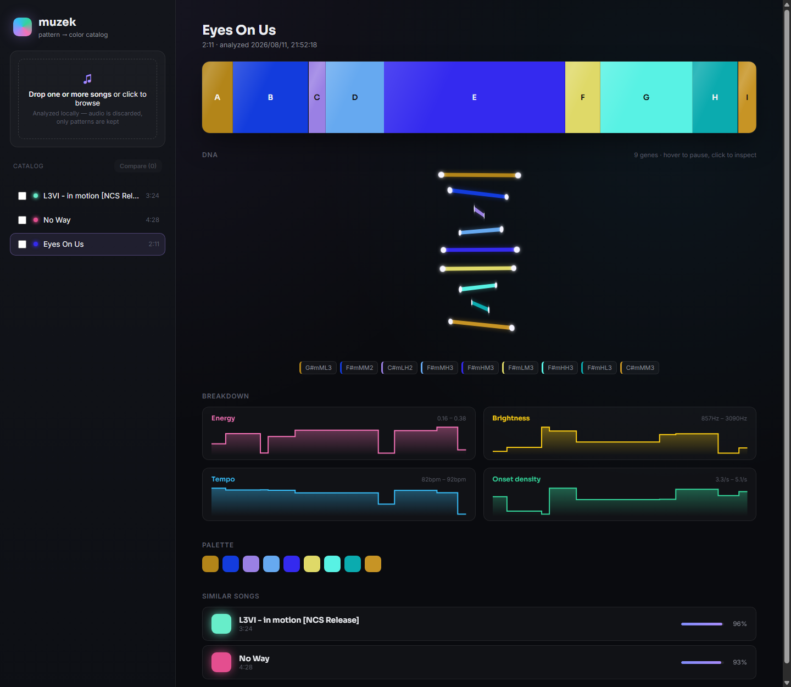
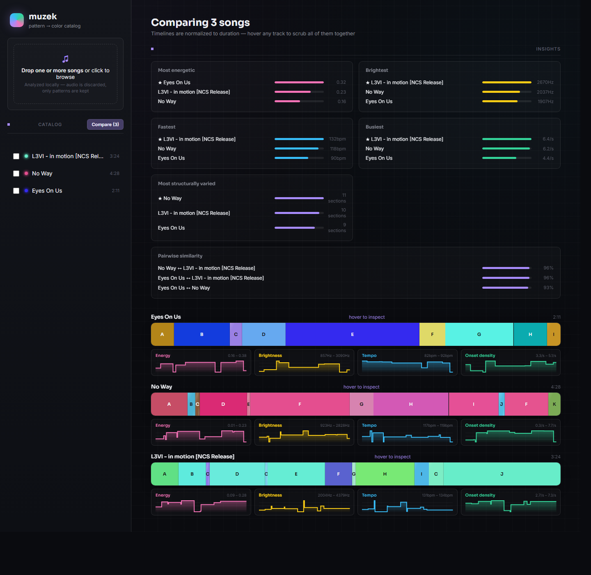

# muzek

Break a song into its patterns — rhythm, harmony, structure, timbre — and map
each piece to a color. Catalog the breakdowns, not the audio.



## Why

This is a passion project for visualizing music through color: every song is
decomposed into structural sections (intro/verse/chorus-shaped, detected and
labeled automatically), and each section gets a deterministic color derived
from its own musical features — key/harmonic content drives hue, energy
drives saturation, brightness drives lightness. Repeated sections (like two
choruses) land on nearly the same color, because they're built from nearly
the same underlying features.

**muzek never stores the songs it analyzes.** Audio is loaded into memory
just long enough to extract features, then discarded — what's cataloged is
only the derived patterns and colors, in a local SQLite database.

## Features

- **Rhythm** — tempo, beat grid, onset density (via `librosa`)
- **Harmony** — chroma content, key estimation (Krumhansl-Schmuckler profiles)
- **Timbre** — brightness (spectral centroid), energy/loudness dynamics, MFCCs
- **Structure** — beat-synced agglomerative segmentation into sections, with
  repeated sections recognized and labeled (A/B/C/...) by similarity
- **Color mapping** — versioned, pluggable algorithms so multiple color
  mappings can be cataloged and compared for the same song
- **Similarity** — songs are ranked against each other by a duration-weighted
  blend of their energy/brightness/tempo/onset-density plus harmonic "shape"
  (their averaged, normalized chroma vector)
- **Web UI** — drag-and-drop (or batch) ingestion, an animated color timeline
  per song, quantitative feature graphs, a similar-songs panel, and a compare
  view that stacks multiple songs' timelines and graphs for direct comparison
- **Interactive comparison** — hovering any stacked track scrubs all of them
  together, live-highlighting whichever section each song is in at that
  normalized position and reading out its key/energy/tempo; an insights
  panel surfaces cross-song takeaways (most energetic, brightest, fastest,
  busiest, most structurally varied, and pairwise similarity) the moment you
  open compare view
- **Song DNA** — each section is encoded into a short genetic-style codon
  (key, mode, energy/brightness/rhythm tier — e.g. `F#mHM3`), strung together
  into the song's "genome" and rendered as an animated, clickable double
  helix. Hover to pause the spin, click a gene (or its chip in the sequence
  strip below) to inspect it — synced with the color timeline and detail
  panel



## Install

Requires Python 3.10+.

```bash
python -m venv .venv
.venv\Scripts\activate      # or: source .venv/bin/activate  (macOS/Linux)
pip install -e .
```

## Usage

### CLI

```bash
# Analyze a song and store its breakdown (audio is discarded after analysis)
muzek analyze path/to/song.mp3 --title "Song Title"

# List everything in the catalog
muzek list

# Print a song's full breakdown as JSON
muzek show 1

# Print a song's DNA: one codon per section, plus the full sequence
muzek dna 1
```

### Web UI

```bash
muzek serve --db-path catalog.sqlite
```

Then open `http://127.0.0.1:5000`. From there you can:

- Drop one or more songs onto the sidebar to analyze them (sequentially, so
  the single-writer SQLite catalog never sees concurrent writes)
- Click a song to see its color timeline, its DNA (an animated double helix,
  clickable gene by gene), quantitative feature graphs, full palette, and its
  most similar cataloged songs
- Check two or more songs and click **Compare** to stack their timelines and
  graphs; hover to scrub all of them at once, or read the insights panel for
  cross-song takeaways
- Deep-link a specific view: `?song=<id>` or `?compare=<id1>,<id2>,...`

## Architecture

```
muzek/
  audio.py           # loads audio into memory; never persists it
  features/
    rhythm.py         # tempo, beat grid, onset density
    harmony.py         # chroma, key estimation
    timbre.py           # brightness, energy, MFCCs
    structure.py         # beat-synced segmentation + repeat labeling
  color/
    mapping.py            # feature -> color, versioned algorithms
  dna.py                    # feature -> genetic-style codon, per section
  similarity.py               # cross-song similarity scoring
  catalog/
    db.py                      # SQLite schema + queries (patterns only, no audio)
  pipeline.py                   # orchestrates analysis end to end
  cli.py                          # `muzek analyze|list|show|dna|serve`
  web/
    app.py                        # Flask app: catalog API + upload endpoint
    templates/, static/            # UI: timeline, DNA, graphs, compare, similarity
```

Analysis flow: `audio.py` loads a file into memory → `features/*` extract
rhythmic/harmonic/timbral descriptors → `features/structure.py` segments the
song into sections and labels repeats → `color/mapping.py` maps each
section's features to a color → `catalog/db.py` persists sections, features,
and colors → the audio buffer is discarded.

## License

MIT — see [LICENSE](LICENSE).
